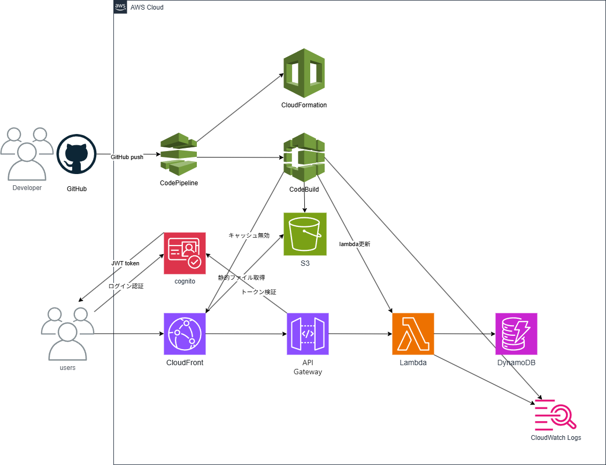

# aws-serverless-memo-cicd

AWSサーバーレスアーキテクチャ（Cognito / API Gateway / Lambda / DynamoDB / S3 / CloudFront）で構築したメモアプリ。CloudFormationによるIaCとCI/CDパイプラインを実装。

## 概要（何を作ったか・目的）

CodeBuild・CodePipelineを用いて、サーバーレス構成のビルド・デプロイ・スタック作成の一連の流れを自動化。

本プロジェクトの目的は以下です：

- CodeBuild・CodePipelineの仕組みを理解する
- CloudFormationによるIaCとCI/CDを組み合わせた自動デプロイを実践する

## 構成 / アーキテクチャ



## 検証時の構成

- リージョン: ap-northeast-1（東京）
- Lambda ランタイム: Node.js 20.x
- DynamoDB: PAY_PER_REQUEST（オンデマンド=使用した分料金発生）
- CloudFront: HTTPS強制 / CachingDisabled（APIルートはユーザーごとに異なるデータを返すためキャッシュ無効）

## 使用技術

### AWS
- **Cognito**
  - JWT認証 / Hosted UI（OAuth 2.0）
- **CloudFront**
  - S3からの静的コンテンツ配信およびAPI Gatewayへのリクエスト転送
- **S3**
  - 静的コンテンツ保持用
- **API Gateway**
  - APIリクエストを受信しLambdaを呼び出す
- **Lambda**
  - Node.js 20.x / メモのCRUD処理
- **DynamoDB**
  - メモデータ保存用
- **AWS CloudFormation**
  - インフラをコードとして管理（IaC）
- **AWS CodeBuild**
  - Lambdaコード・CloudFormationテンプレート・フロントエンドファイルのビルドおよびS3への格納
- **AWS CodePipeline**
  - GitHubと連携しコード変更を検知後、CodeBuildの実行・CloudFormationによるスタック作成の流れを管理

### 設計・その他
- **draw.io**：構成図作成
- **GitHub**：テンプレートおよびREADME管理

## CloudFormation構成の説明

本テンプレートでは、CloudFormationを用いて以下を自動構築します：

- Cognito
- API Gateway
- Lambda
- DynamoDB
- CloudFront
- S3

## デプロイ方法

1. buildspec.yml・Lambda・CloudFormationテンプレート・フロントエンドファイルをGitHubに保存
2. CodePipelineがコードの変更を検知し、ビルド・デプロイ・スタック作成を自動実行

## 工夫・学習したポイント

- CloudFormationの循環依存を `Parameters` / `Conditions` / `!If` を活用した2段階デプロイで解消
- CodePipelineのRunOrderでスタック作成とファイルアップロードの順序を制御
- IAMロールを用途ごとに分離し最小権限を意識した設計

## 開発中に直面した課題と解決策

### 問題1
CloudFormationでスタックが削除できない（`DELETE_FAILED`）

**原因**
- スタック間の循環依存（api-stack → cognito-stack → frontend-stack → api-stack）により相互参照が発生
- S3バケットのVersioningが有効なため、見た目は空でも削除マーカーや旧バージョンが残っていた
- `DELETE_FAILED`状態は自動復旧しない

**解決策**
- frontend-stackから `!ImportValue MemoApiId` を削除して循環依存を解消
- `aws cloudformation list-imports` でImport状況を確認し依存解除を検証
- S3バケットのバージョン・削除マーカーをすべて削除後にスタックを再削除
- 削除順序: api-stack → cognito-stack → frontend-stack → lambda-stack → dynamodb-stack

---

### 問題2
スタック間の循環依存によりデプロイ失敗

**原因**
- api-stack・cognito-stack・frontend-stackが相互に `ImportValue` で参照し合っており、どの順番で作成しても依存関係を解決できなかった

**解決策**
- CloudFormationの `Parameters` / `Conditions` / `!If` + `AWS::NoValue` を使用し2段階デプロイで解消
  1. frontend-stackを `EnableApi=false` で作成（API参照なし）
  2. cognito / lambda / api-stackを順に作成
  3. frontend-stackを `EnableApi=true` で更新
- CodePipelineの「Parameter overrides」で `EnableApi` を切り替え

---

### 問題3
CodeBuildで `package.json が見つからない` エラーが発生

**原因**：フロントエンドが静的ファイル構成でNode.jsプロジェクトではないため `package.json` が存在しなかった  
**解決策**：`npm install` / `npm run build` を削除しS3へ直接アップロードする構成に変更

---

### 問題4
CodeBuildで `requirements.txt が見つからない` エラーが発生

**原因**：Python依存関係ファイルを使用していない構成だった  
**解決策**：該当コマンドを削除

---

### 問題5
CodeBuildで `cp cloudformation/*.yaml` が失敗

**原因**：buildspec.ymlに記載したフォルダ名が `cloudformation/` だったが実際のフォルダ名は `cfn/` だった  
**解決策**：パスを `cfn/*.yaml` に修正

---

### 問題6
CodePipeline → CloudFormation 権限エラー

**原因**：CodePipelineのIAMロールにCloudFormation操作権限が不足していた  
**解決策**：`AWSCloudFormationFullAccess` をアタッチ

---

### 問題7
`iam:PassRole` エラー

**原因**：CodePipelineがCloudFormation用ロールを引き渡す権限を持っていなかった  
**解決策**：以下ポリシーを追加

```json
{
  "Effect": "Allow",
  "Action": "iam:PassRole",
  "Resource": "arn:aws:iam::<account-id>:role/myapp-cloudformation-role"
}
```

---

### 問題8
`ROLLBACK_COMPLETE` によりスタック再作成不可

**原因**：初回デプロイ失敗後のスタックが残存していた  
**解決策**：該当スタックを削除して再実行

---

### 問題9
`No export named XXX found` エラー

**原因**：スタックの作成順序ミスにより依存関係が未解決だった  
**解決策**：CodePipelineのRunOrderを修正し正しい順序で実行

---

### 問題10
ログインボタン押下時に Cognito が 400 Bad Request を返す

**原因**：フロントエンドの `client_id` が削除済みのアプリクライアントを参照していた  
**解決策**：Cognitoコンソールで正しい `client_id` を確認しlogin.jsを修正してデプロイ

---

### 問題11
サイトにアクセスするとXMLエラー（AccessDenied）が表示される

**原因**
- CloudFormationが作成するS3バケット名とファイル格納処理に書いていたバケット名が不一致
- S3バケットが存在する前にフロントエンドファイルを格納する処理が実行されていた

**解決策**
- CloudFormationで作成されるバケット名とbuildspec.ymlのバケット名を一致させる
- CodePipelineにスタック作成完了後にフロントエンドファイルを格納するステージ（FrontendDeploy）を追加し順序を保証

---

## 学び（まとめ）

- CI/CDでは**依存関係と実行順序**が最重要
- IAMは**誰が何を実行するか**を常に意識する
- CloudFormationは**一度失敗したスタックは再利用できない**（削除して再作成が必要）
- エラーの原因はほぼ**権限・パス・順序**のいずれか
- S3のVersioningが有効な場合、**見た目が空でも削除できない**ことがある
